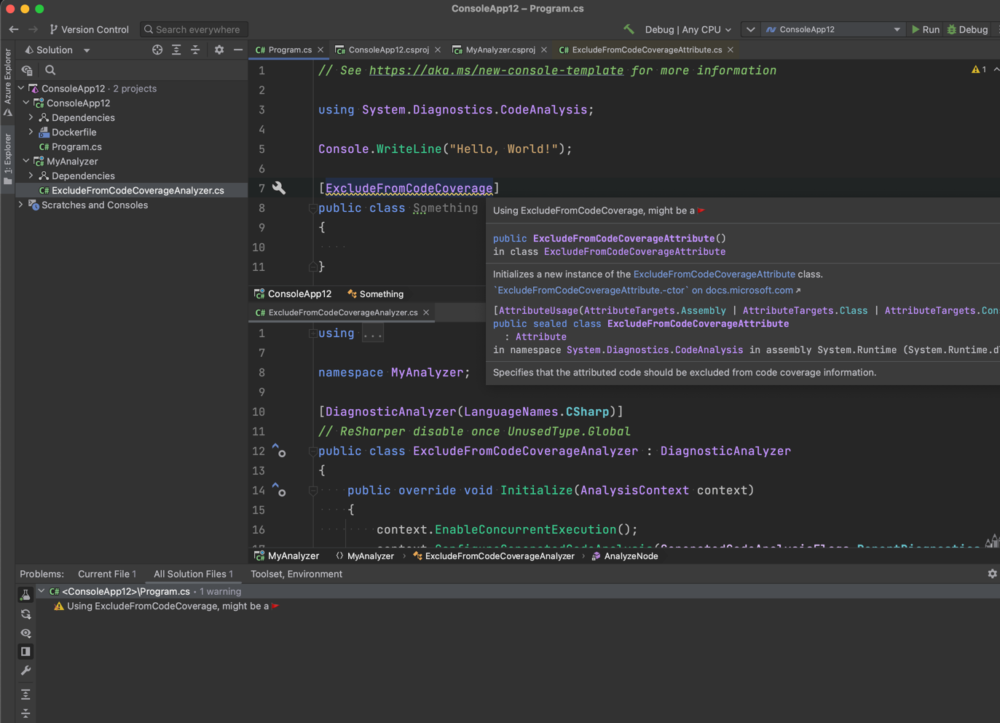

## JetBrains Rider Running Custom Analyzer

This solution is targeting .NET 6. Be sure to check your Rider settings to see if the Analyzer shows up.

If the analyzer isn't showing up, you may need to modify your inspection settings.

